## Linux Permissions Exercise 

#### Goal: To create groups and assign relevant permissions to its members. Verify access by accessing it from unauthorized users.

#### Task: Create a group called dev-team and add two members (John and Bob) to it. Create a folder /home/devops-team and change ownership to group dev-team. Verify that both users in the dev-team group have read and write access to the folder.

#### Create another group project-manager and add a user Fatima to it. Verify if the folder /home/devops-team is accessible by Fatima.

___
<p> Note: For clarity of implementation, try to visualise the request and execute according </p>

&nbsp;

## Linux Permissions Solutions with Screen Shots

#### Step 1: Switch to root user using the code below in your linux terminal

```bash
sudo -i

OR

sudo su
```
<!-- Images -->

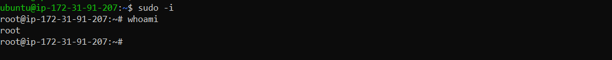

&nbsp;

#### Step 2: Create a group devops-team 

```bash 
groupadd devops-team 
cat /etc/group | grep devops-team
```
<!-- Images -->

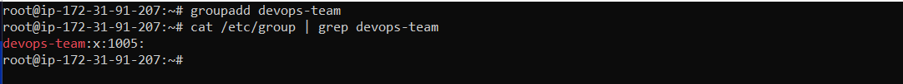

&nbsp;

#### Step 3: Create two users Jonas and Basmat and add them to the devops-team group

```bash 
useradd -G devops-team Jonas
useradd -G devops-team Basmat
cat /etc/group | grep devops-team
```
<!-- Images -->

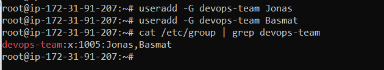

&nbsp;

#### Step 4: Password the two users Jonas and Basmat 

```bash 
passwd Jonas
passwd Basmat
```
<!-- Images -->

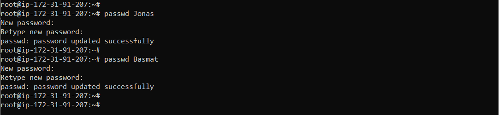

&nbsp;

#### Step 5: Create directory in /home and name it devops-team

```bash 


```
<!-- Images -->

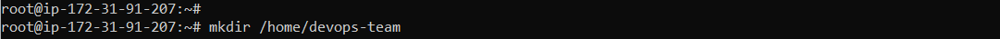

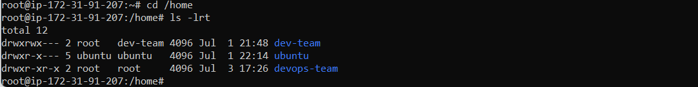

&nbsp;

#### Step 6: Change the group ownershot of the folder devops-team to devops-team  

```bash 
chown :devops-team /home/devops-team/

ls -l

OR 

ls -lrt
```
<!-- Images -->

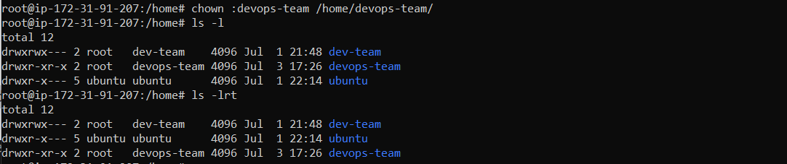

&nbsp;

#### Step 7: Make sure the permissions of the devops-team folder allow group members to create and delete files  

```bash 
chmod g+w /home/devops-team/

ls -lrt

OR 

ls -l
```
<!-- Images -->

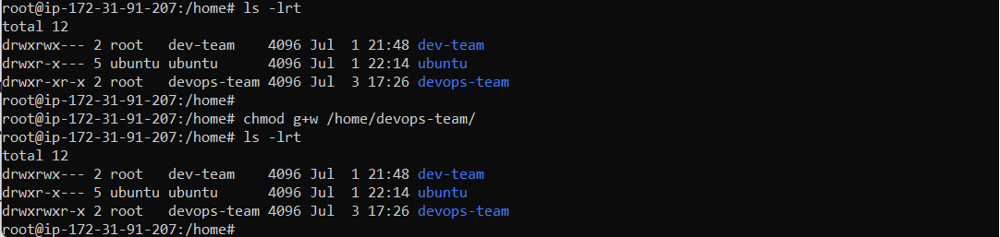

&nbsp;

#### Step 8: Ensure others don't have any access to the files in the devops-team folder   

```bash 
chmod o-rx /home/devops-team/

ls -lrt

OR 

ls -l
```
<!-- Images -->

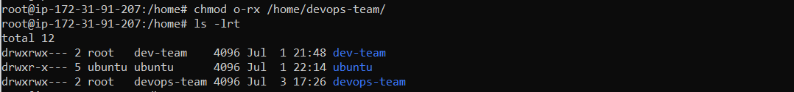

&nbsp;


#### Step 9: 
- Exit the root session and switch to Jonas   
- Navigate to the folder /home/devops-team/
- Create an empty file in the folder called jonas-file.txt
- Change the group ownership of the file to the group devops-team
- verify the information is as requested

```bash 
exit 

su Jonas 

whoami

cd /home/devops-team/

touch jonas-file.txt

ls -lrt

OR 

ls -l

chown :devops-team jonas-file.txt

ls -lrt

```
<!-- Images -->


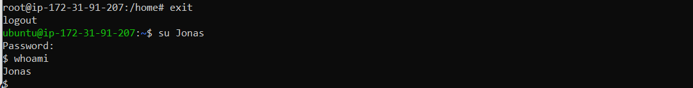

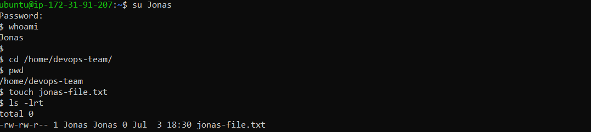

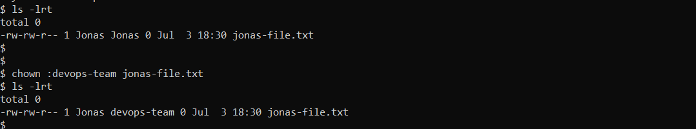

&nbsp;


#### Step 10: 
- Exit the shell user and switch to Basmat
- Navigate to the path /home/devops-team/
- Find out Basmat privileges to access the jonas-file.txt
- Modify the file jonas-file.txt while logged in as Basmat
- Verify the the info added into jonas-file.txt was entered correctly

```bash 
exit 

su Basmat

whoami

ls -l | grep jonas-file.txt

echo "This is Basmat's comment" > jonas-file.txt

cat jonas-file.txt
```
<!-- Images -->

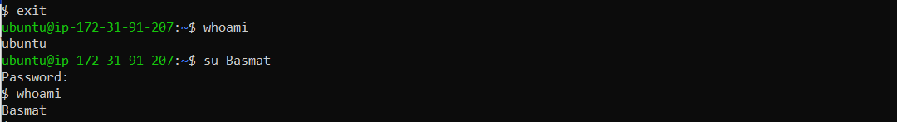

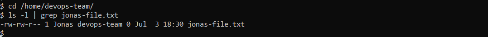

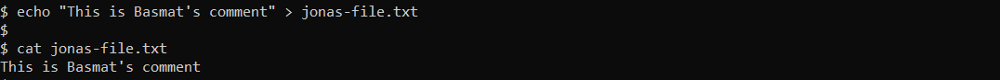

&nbsp;

#### Step 11: 
- Create another group project-manager and assign user Kate to it
- Navigate to the folder /home/devops-team/ and verify if Kate can access it 
- We get an error when trying to access it
- This is because others does not have any access to the folder devops-team


```bash 
groupadd project-manager
useradd -G project-manager Kate
passwd Kate
```
<!-- Images -->

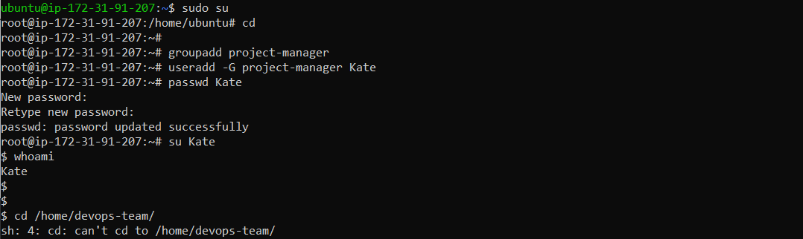

- If we recall, the others do not have access to the devops-team folder. See image of right below:

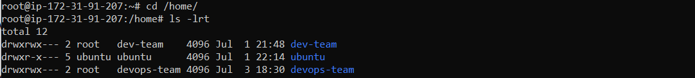
&nbsp;

