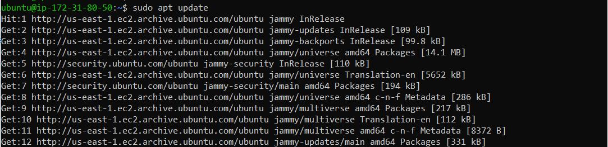
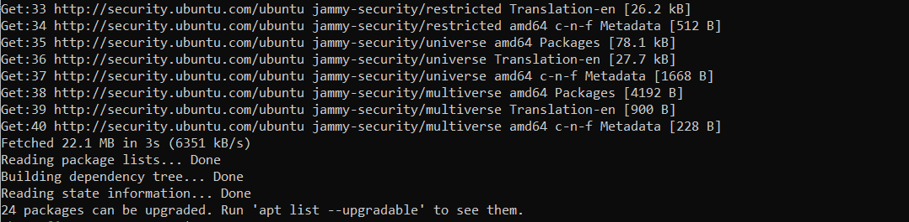
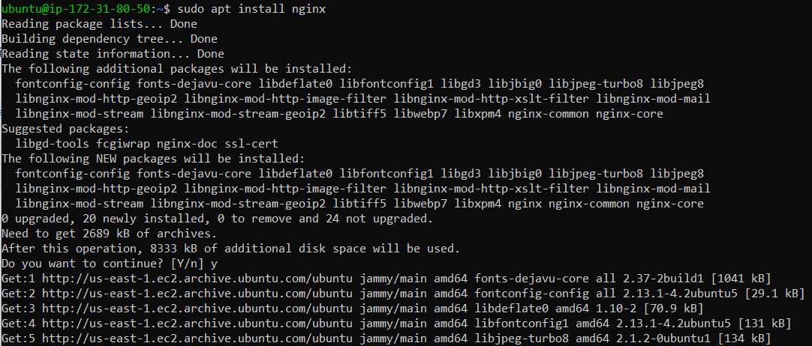
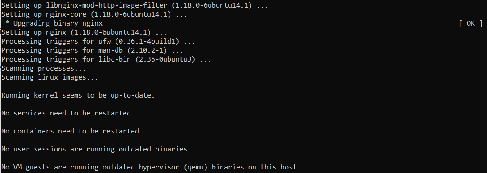
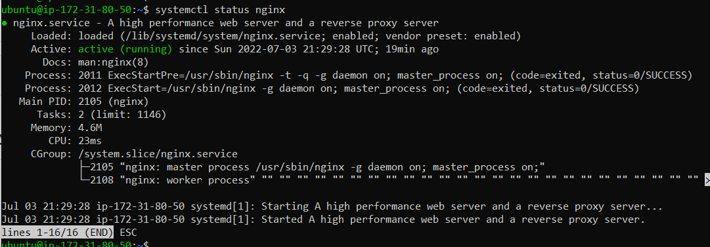
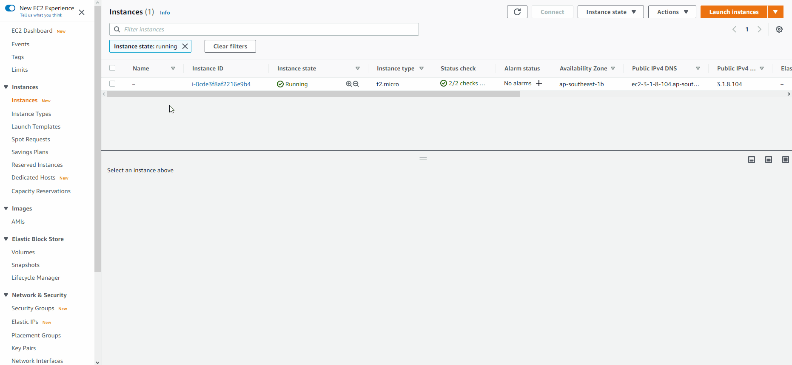
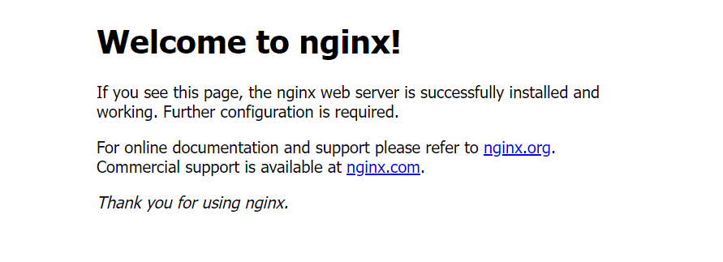

## Project 2: LEMP STACK IMPLEMENTATION

#### Step 1: Create AWS virtual server 

#### Step 2: 
- update the servers package index using the apt update 
- install the nginx server web server 
- Verify the ngix server is up and running
- Open port 80 to receive any traffice from the web server
- As we know, we have TCP port 22 open by default on our EC2 machine to access it via SSH, so we need to add a rule to EC2 configuration to open inbound connection through port 80:

```bash
#update a list of packages in package manager
sudo apt update

#run nginx pakage installation
sudo apt install nginx

#check the status of the nginx web server if running appropriately
sudo systemctl status ngix

```

<!-- Images -->











- Process for opening port 80



- NGINX web server accessible 


#### Step 3: INSTALLING MYSQL
- Install mysql server 
- When prompted press Y and then enter 
- When installation is complete, log into mysql 
- It’s recommended that you run a security script that comes pre-installed with MySQL. This script will remove some insecure default settings and lock down access to your database system. Before running the script you will set a password for the root user, using mysql_native_password as default authentication method. We’re defining this user’s password as PassWord.1.

```bash
#use apt to acquire and install mysql server
sudo apt install msql-server

#log into mysql 
sudo mysql

#
ALTER USER 'root'@'localhost' IDENTIFIED WITH mysql_native_password BY 'PassWord.1';

#Exit mysql shell with 
exit 

```

- Start the interactive script by running 

```bash 
sudo mysql_secure_installation

```

<p>This will ask if you want to configure the VALIDATE PASSWORD PLUGIN.

Note: Enabling this feature is something of a judgment call. If enabled, passwords which don’t match the specified criteria will be rejected by MySQL with an error. It is safe to leave validation disabled, but you should always use strong, unique passwords for database credentials.

Answer Y for yes, or anything else to continue without enabling.</p>

- Test if you’re able to log in to the MySQL console by typing:

```bash 
sudo mysql -p

exit
```

#### Step 4: INSTALLING PHP
- Install two packages at once with a single line of code
- You have Nginx installed to serve your content and MySQL installed to store and manage your data. Now you can install PHP to process code and generate dynamic content for the web server.
```bash 
#installing the PHP fastCGI process manager”, and tell Nginx to pass PHP requests to this software for processing

#Additionally, you’ll need php-mysql, a PHP module that allows PHP to communicate with MySQL-based databases

sudo apt install pho-fpm php-mysql

```

#### Step 4: CONFIGURING NGINX TO USE PHP PROCESSOR
- Creating the root web directory for your_domain as follows: 
 
```bash 
#make the project folder directory
sudo mkdir /var/www/projectLEMP

```

- Next, assign ownership of the directory with the $USER environment variable, which will reference your current system user:
```bash 
#
sudo chown -R $USER:$USER /var/www/projectLEMP
```

- Then, open a new configuration file in Nginx’s sites-available directory using your preferred command-line editor. Here, we’ll use nano:
```bash 
#
sudo nano /etc/nginx/sites-available/projectLEMP
```

- This will create a new blank file. Paste in the following bare-bones configuration:
```bash 
#/etc/nginx/sites-available/projectLEMP

server {
    listen 80;
    server_name projectLEMP www.projectLEMP;
    root /var/www/projectLEMP;

    index index.html index.htm index.php;

    location / {
        try_files $uri $uri/ =404;
    }

    location ~ \.php$ {
        include snippets/fastcgi-php.conf;
        fastcgi_pass unix:/var/run/php/php8.1-fpm.sock;
     }

    location ~ /\.ht {
        deny all;
    }

}
```

##### Here’s what each of these directives and location blocks do:

- listen — Defines what port Nginx will listen on. In this case, it will listen on port 80, the default port for HTTP.
- root — Defines the document root where the files served by this website are stored.
- index — Defines in which order Nginx will prioritize index files for this website. It is a common practice to list index.html files with a higher precedence than index.php files to allow for quickly setting up a maintenance landing page in PHP applications. You can adjust these settings to better suit your application needs.
- server_name — Defines which domain names and/or IP addresses this server block should respond for. Point this directive to your server’s domain name or public IP address.
- location / — The first location block includes a try_files directive, which checks for the existence of files or directories matching a URI request. If Nginx cannot find the appropriate resource, it will return a 404 error.
- location ~ \.php$ — This location block handles the actual PHP processing by pointing Nginx to the fastcgi-php.conf configuration file and the php7.4-fpm.sock file, which declares what socket is associated with php-fpm.
- location ~ /\.ht — The last location block deals with .htaccess files, which Nginx does not process. By adding the deny all directive, if any .htaccess files happen to find their way into the document root ,they will not be served to visitors.

- When you’re done editing, save and close the file. If you’re using nano, you can do so by typing CTRL+X and then y and ENTER to confirm.

- Activate your configuration by linking to the config file from Nginx’s sites-enabled directory:
```bash 
#
sudo ln -s /etc/nginx/sites-available/projectLEMP /etc/nginx/sites-enabled/
```

- This will tell Nginx to use the configuration next time it is reloaded. You can test your configuration for syntax errors by typing:
```bash 
#
sudo nginx -t
```

- You shall see following message:
```bash 
nginx: the configuration file /etc/nginx/nginx.conf syntax is ok
nginx: configuration file /etc/nginx/nginx.conf test is successful
```


- If any errors are reported, go back to your configuration file to review its contents before continuing.
- We also need to disable default Nginx host that is currently configured to listen on port 80, for this run:

```bash 
#
sudo unlink /etc/nginx/sites-enabled/default
```

- When you are ready, reload Nginx to apply the changes:
```bash 
#
sudo systemctl reload nginx
```

- Your new website is now active, but the web root /var/www/projectLEMP is still empty. Create an index.html file in that location so that we can test that your new server block works as expected:
```bash 
#
sudo echo 'Hello LEMP from hostname' $(curl -s http://169.254.169.254/latest/meta-data/public-hostname) 'with public IP' $(curl -s http://169.254.169.254/latest/meta-data/public-ipv4) > /var/www/projectLEMP/index.html
```

- Now go to your browser and try to open your website URL using IP address:
```bash 
#
http://<Public-IP-Address>:80
```

<p>If you see the text from ‘echo’ command you wrote to index.html file, then it means your Nginx site is working as expected.
In the output you will see your server’s public hostname (DNS name) and public IP address. You can also access your website in your browser by public DNS name, not only by IP – try it out, the result must be the same (port is optional)</p>

```bash 
http://<Public-DNS-Name>:80
```

<p>You can leave this file in place as a temporary landing page for your application until you set up an index.php file to replace it. Once you do that, remember to remove or rename the index.html file from your document root, as it would take precedence over an index.php file by default. </p>

<p>Your LEMP stack is now fully configured. In the next step, we’ll create a PHP script to test that Nginx is in fact able to handle .php files within your newly configured website.</p>


#### Step 5: TESTING PHP WITH NGINX

Your LEMP stack should now be completely set up.

At this point, your LAMP stack is completely installed and fully operational.

You can test it to validate that Nginx can correctly hand .php files off to your PHP processor.

You can do this by creating a test PHP file in your document root. Open a new file called info.php within your document root in your text editor:

```bash 
#
sudo nano /var/www/projectLEMP/info.php
```

##### You can now access this page in your web browser by visiting the domain name or public IP address you’ve set up in your Nginx configuration file, followed by /info.php:

```bash 
#
http://`server_domain_or_IP`/info.php
```

- You will see a web page containing detailed information about your server:


<p>After checking the relevant information about your PHP server through that page, it’s best to remove the file you created as it contains sensitive information about your PHP environment and your Ubuntu server. You can use rm to remove that file:</p>

```bash 
sudo rm /var/www/your_domain/info.php
```

##### You can always regenerate this file if you need it later.


#### Step 6: RETRIEVING DATA FROM MYSQL DATABASE WITH PHP (CONTINUED)

In this step you will create a test database (DB) with simple "To do list" and configure access to it, so the Nginx website would be able to query data from the DB and display it.

At the time of this writing, the native MySQL PHP library mysqlnd doesn’t support caching_sha2_authentication, the default authentication method for MySQL 8. We’ll need to create a new user with the mysql_native_password authentication method in order to be able to connect to the MySQL database from PHP.

We will create a database named example_database and a user named example_user, but you can replace these names with different values.

- First, connect to the MySQL console using the root account:
```bash 
#
sudo mysql
```

- To create a new database, run the following command from your MySQL console:
```
#
CREATE DATABASE `example_database`;
```

Now you can create a new user and grant him full privileges on the database you have just created.

The following command creates a new user named example_user, using mysql_native_password as default authentication method. We’re defining this user’s password as password, but you should replace this value with a secure password of your own choosing.

```bash 
#
CREATE USER 'example_user'@'%' IDENTIFIED WITH mysql_native_password BY 'password';
```

Now we need to give this user permission over the example_database database:

```bash 
#
GRANT ALL ON example_database.* TO 'example_user'@'%';
```

- This will give the example_user user full privileges over the example_database database, while preventing this user from creating or modifying other databases on your server.

Now exit the MySQL shell with:
```bash 
#
exit 
```

You can test if the new user has the proper permissions by logging in to the MySQL console again, this time using the custom user credentials:

```bash 
-u example_user -p
```

Notice the -p flag in this command, which will prompt you for the password used when creating the example_user user. After logging in to the MySQL console, confirm that you have access to the example_database database:
```bash 
#
SHOW DATABASES;
```

This will give you the following output:


- Next, we’ll create a test table named todo_list. From the MySQL console, run the following statement:
```bash 
#
CREATE TABLE example_database.todo_list (
    item_id INT AUTO_INCREMENT,
    content VARCHAR(255),
    PRIMARY KEY(item_id)
 );
 ```
 
 Insert a few rows of content in the test table. You might want to repeat the next command a few times, using different VALUES:
 ```bash 
 #
 INSERT INTO example_database.todo_list (content) VALUES ("My first important item");
 
 INSERT INTO example_database.todo_list (content) VALUES ("My second important item");
 
 INSERT INTO example_database.todo_list (content) VALUES ("My third important item");
 
 INSERT INTO example_database.todo_list (content) VALUES ("and this is one more thing");
 ```
 
 - To confirm that the data was successfully saved to your table, run:
 ```bash
 #
 SELECT * FROM example_database.todo_list;
 ```
 
 - After confirming that you have valid data in your test table, you can exit the MySQL console:
 ```bash 
 exit 
 ```
 - Now you can create a PHP script that will connect to MySQL and query for your content. Create a new PHP file in your custom web root directory using your preferred editor. We’ll use vi for that:
 
```bash 
#
nano /var/www/projectLEMP/todo_list.php
```

The following PHP script connects to the MySQL database and queries for the content of the todo_list table, displays the results in a list. If there is a problem with the database connection, it will throw an exception.

Copy this content into your todo_list.php script:

```bash 
#
<?php
$user = "example_user";
$password = "password";
$database = "example_database";
$table = "todo_list";

try {
  $db = new PDO("mysql:host=localhost;dbname=$database", $user, $password);
  echo "<h2>TODO</h2><ol>";
  foreach($db->query("SELECT content FROM $table") as $row) {
    echo "<li>" . $row['content'] . "</li>";
  }
  echo "</ol>";
} catch (PDOException $e) {
    print "Error!: " . $e->getMessage() . "<br/>";
    die();
}
```

Save and close the file when you are done editing.

You can now access this page in your web browser by visiting the domain name or public IP address configured for your website, followed by /todo_list.php:
```bash 
#
http://<Public_domain_or_IP>/todo_list.php
```

#### You should see a page like this, showing the content you’ve inserted in your test table:


<p> That means your PHP environment is ready to connect and interact with your MySQL server.</p>
 

